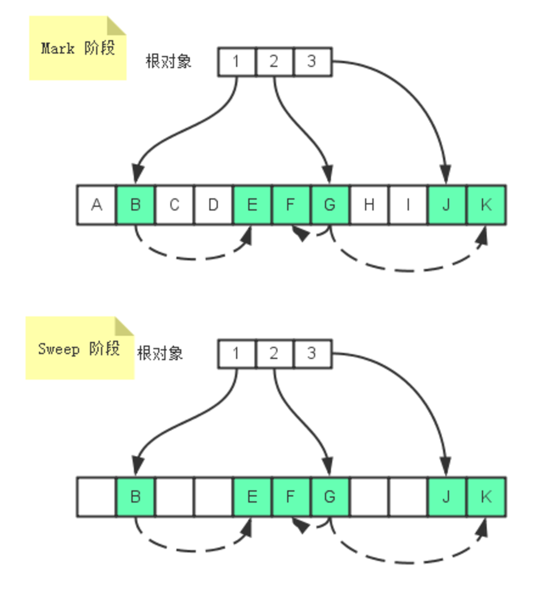

# 垃圾回收与内存泄漏

## 垃圾回收--引用计数

将资源的被引用次数保存起来，当被引用次数变为零时就将其释放的过程。

会导致更多的内存泄漏，已不被采用。

### 导致的特殊内存泄漏

循环引用导致内存不能正常被回收

```
// 函数 a 执行完后，本来 x, y 对象都应该在垃圾回收阶段被回收， 可是由于存在循环引用，也不能被回收。

function a () {
    var x = {};
    var y = {};
    x.z = y;
    y.z = x;
}
a();
```

IE 6, 7 对DOM对象进行引用计数回收，这样简单的垃圾回收机制，非常容易出现循环引用问题导致内存不能被回收， 进行导致内存泄露等问题。

```
!function(){
    // IE 6, 7 中下列代码会导致 btn 不能被回收
    var btn = document.getElementsByTagName('button');
    btn.onclick = function(){
        console.log(btn.innerHTML);
    };
}();
```

## 垃圾回收--标记清除

标记清除的方式需要对程序的对象进行两次扫描，第一次从根（Root）开始扫描，被根引用了的对象标记为不是垃圾，不是垃圾的对象引用的对象同样标记为不是垃圾，以此递归。所有不是垃圾的对象的引用都扫描完了之后。就进行第二次扫描，第一次扫描中没有得到标记的对象就是垃圾了，对此进行回收。

大多数浏览器采用此回收机制。



## 内存泄漏

### 意外的全局变量

```
function foo(arg) {
    // 没有 var 时，默认全局
    bar = {};
}
```

### 偶然创建全局变量

```
function foo() {
    this.bar = {};
}
// 此时执行 foo 函数，this 其实是指代 window
foo();
```

### 没有及时清除的定时器和回调函数

```
// 未清除定时器
!function(){
    var node = document.getElementById('search');
    setInterval(function() {
        console.log(node);
        if(node) {
            node.innerHTML = new Date();
        }
    }, 1000);
    // 移除node节点
    node.remove();
}();

// 未清除回调函数
!function(){
    var element = document.getElementById('button');
    function onClick(event) {
        element.innerHtml = 'text';
    }
    element.addEventListener('click', onClick);
    // 在 IE6、IE7 浏览器上，移除 node 之前需要手动的 removeEventListener，这样才能保证 element 被正常回收（其实就是循环引用）
    element.removeEventListener('click', onClick);
    element.parentNode.removeChild(element);
}();
```

### DOM之外的引用

```
<div id="root">
    <div id="app">
        <div id="son"></div>
    </div>
</div>

var app = document.getElementById('app');
var son = document.getElementById('son');
app.remove(); // 移除 app 节点
console.log(son.parentNode); // app 可访问，son 在全局的引用，导致 app 的 dom 没有被释放
```

### 闭包被外部引用

```
var replaceThing = function () {
      // 为了方便观察内存情况，创建了一个很大的字符串，这样数组本身会占用很大的内存
      var originalThing = new Array(100000000).join('*');
      var outer = 'outer str';
      console.log('new...');
      return function () {
        if (originalThing)
          console.log(outer);
      };
    };
// 由于生成的函数被 closureFn 引用，所以内存不释放
var closureFn = replaceThing();
closureFn();
// 使用以下方式可以得到释放
replaceThing()();
```

### 多重闭包

```
var theThing = null;
var replaceThing = function () {
  var originalThing = theThing;
  var unused = function () {
    if (originalThing)
      console.log('hi');
  };
  theThing = {
    // 为了方便观察内存情况，创建了一个很大的字符串，这样数组本身会占用很大的内存
    longStr: new Array(100000000).join('*'),
    someMethod: function () {
      console.log('123');
    }
  };
};
// 每1秒执行一次，看内存变化
setInterval(replaceThing, 1000);
// 由于 unused 和 theThing.someMethod 在一个闭包内，导致共享一个闭包作用域，从而关联两个函数，但是不会造成对 originalThing 的关联。originalThing 的关联是由 unused 内部引用导致的。由此可见 replaceThing 内部的变量都被紧密联系在一起。
```

## 如何避免内存泄漏

- 尽量避免使用全局变量，例如使用立即执行函数的形式。
- 使用“严格模式”开发，避免因为我们的疏忽导致意外产生全局变量。
- 对于一些占用内存较大的对象，在变量不在使用后，手动将其赋值为 null，例如前面例子中的超大的数组。
- 尽量避免把内部变量赋予外层引用，例如上面例子中的 theThing 变量