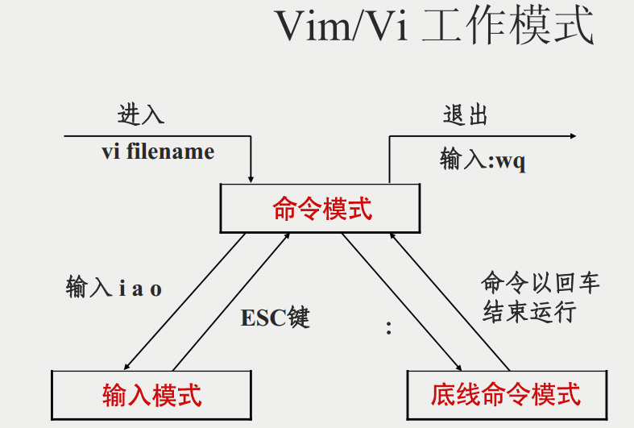

# Vim 简单操作

> 教程 http://www.runoob.com/linux/linux-vim.html
> 
> 操作手册 https://github.com/xingkongbj/study_web/blob/master/服务器/Vim/Vim用户手册中文版74.pdf

目录

- [模式切换示意图](#模式切换示意图)
- [键盘图](#键盘图)
- [命令模式切换到底线命令模式](#命令模式切换到底线命令模式)
    - [指令行的储存、离开等指令](#指令行的储存离开等指令) 
    - [vim 环境的变更](#vim-环境的变更)
- [命令模式切换到输入模式](#命令模式切换到输入模式)
    - [进入插入或取代的编辑模式](#进入插入或取代的编辑模式)  

`vi 文件名`进入vim编辑器，进入时为命令模式。

## 模式切换示意图

## 键盘图

## 命令模式切换到底线命令模式

惊叹号 (!) 在 vi 当中，常常具有『强制』的意思

### 指令行的储存、离开等指令

语&nbsp;&nbsp;&nbsp;&nbsp;&nbsp;&nbsp;&nbsp;&nbsp;&nbsp;&nbsp;&nbsp;&nbsp;&nbsp;&nbsp;&nbsp;&nbsp;&nbsp;&nbsp;&nbsp;&nbsp;&nbsp;&nbsp;&nbsp;&nbsp;&nbsp;&nbsp;&nbsp;&nbsp;句 | 作用
--- | --- 
:w | 将编辑的数据写入硬盘档案中(常用)
:w! | 若文件属性为『只读』时，强制写入该档案。不过，到底能不能写入， 还是跟你对该档案的档案权限有关啊！
:q | 离开 vi (常用)
:q! | 若曾修改过档案，又不想储存，使用 ! 为强制离开不储存档案。
:wq | 储存后离开，若为 :wq! 则为强制储存后离开 (常用)
ZZ | 这是大写的 Z 喔！若档案没有更动，则不储存离开，若档案已经被更动过，则储存后离开！
:w [filename] | 将编辑的数据储存成另一个档案（类似另存新档）
:r [filename] | 在编辑的数据中，读入另一个档案的数据。亦即将 『filename』 这个档案内容加到游标所在行后面
:n1,n2 w [filename] | 将 n1 到 n2 的内容储存成 filename 这个档案。
:! command | 暂时离开 vi 到指令行模式下执行 command 的显示结果！例如 『:! ls /home』即可在 vi 当中察看 /home 底下以 ls 输出的档案信息！

### vim 环境的变更

语句 | 作用
--- | --- 
:set nu | 显示行号，设定之后，会在每一行的前缀显示该行的行号
:set nonu | 与 set nu 相反，为取消行号！

## 命令模式切换到输入模式

出现『--INSERT--』或『--REPLACE--』的字样

### 进入插入或取代的编辑模式

语&nbsp;&nbsp;&nbsp;&nbsp;句 | 作用
--- | --- 
i, I | 进入插入模式(Insert mode)： i 为『从目前光标所在处插入』， I 为『在目前所在行的第一个非空格符处开始插入』。 (常用)
a, A | 进入插入模式(Insert mode)： a 为『从目前光标所在的下一个字符处开始插入』， A 为『从光标所在行的最后一个字符处开始插入』。(常用)
o, O | 进入插入模式(Insert mode)： 这是英文字母 o 的大小写。o 为『在目前光标所在的下一行处插入新的一行』； O 为在目前光标所在处的上一行插入新的一行！(常用)
r, R | 进入取代模式(Replace mode)： r 只会取代光标所在的那一个字符一次；R会一直取代光标所在的文字，直到按下 ESC 为止；(常用)
[Esc] | 退出编辑模式，回到一般模式中(常用)

